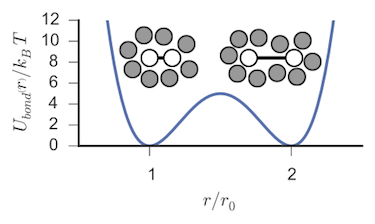

## Bistable dimer in a dense fluid of WCA particles



This example illustrates the use of WESTPA to perform a Weighted Ensemble (WE) simulation
of a small 216 particle system consisting of a bistable dimer in a dense fluid of WCA particles using [OpenMM](http://openmm.org/).
The simulations are run under equilibrium conditions, with the goal of calculating the distribution of the dimer extension distance
as well as the interconversion rates between the compact and extended states.
The model is adapted from the work of [Nilmeier, et al (2011) PNAS](https://dx.doi.org/10.1073/pnas.1106094108),
and the code to build the system (`wcadimer.py`), which we package with the example, was generously provided by the authors and is available in 
its original form at https://simtk.org/home/ncmc. 
The model was first described by [Straub, Borkovec and Berne](http://dx.doi.org/10.1063/1.455678) and was later revisited by 
[Dellago, Bolhuis and Chandler](http://dx.doi.org/10.1063/1.478569). 
Subsequently, variants of the basic model have been used extensively in the rare-event sampling literature. 

Here we provide the code necessary to run a brute force reference simulation as well as WE simulations using either WESTPA's 
executable propagator or a custom propagator method that takes direct advantage of OpenMM's python API. 
The latter method has the advantage of initializing the system once per worker process rather than once per segment trajectory,
thus cutting down on overhead costs.
Instructions are also provided to reproduce the analysis of the system and reproduce relevant figures from the WESTPA paper.

**Note:** The WE simulations were not optimized for efficiency and are provided primarily to illustrate WESTPA's use and to
demonstrate its correctness.

### Requirements

This example has been tested with WESTPA 1.0b1 and OpenMM 6.1. Attempts will be made to keep this example up-to-date as 
both pieces of software evolve.
All of WESTPA's requirements should be satisfied by the [Anaconda](https://store.continuum.io/cshop/anaconda/) python distribution.
Additionally, generating the figures in the analysis requires the [Seaborn](http://web.stanford.edu/~mwaskom/software/seaborn/index.html) library.

Finally, all simulations were performed using OpenMM's CUDA platform on a system with four GPUs. 
Within each of the codes, there are references both the the platform and the number of devices that are hardcoded.
The relevant lines in the code will be noted, but if you are attempting to run this example with a different set of hardware, some small alterations
to the source is required.
For systems without an OpenMM-compatible GPU, the `CPU` platform will allow you to run all of the example simulations, although it is likely that
the simulations will run much slower.
The `CPU` platform has a single property `CpuThreads`, which sets the number of cores to use. 
This value defaults to the number of cores on the machine. 
For the WE simulations, `CpuThreads` is set so each worker only uses a single core.

### Brute force simulation

We run a long brute force trajectory to act as a reference for comparison with the WE results.
This section can be skipped if a direct comparison is not desired.

Within the `run-md-solvtent-langevin.py` script, you may adjust the `niterations` variable to control the length of the simulation
(the provided setting of `1000000` should result in nearly 500 transitions) and the `deviceid` variable determines which GPU to run on.
Simulations were internally tested on a workstation with 4 NVidia GTX 680s, and the `deviceid` is set to `0` to run on the 1st GPU.
The `deviceid` is ignorned when using the `CPU` platform.

*Running on this hardware configuration, the total simulation time is approximately 10 hours.*

To run the simulation:

```
cd bruteforce
python run-md-solvent-langevin.py
```

Analysis of this simulation can be run by excecuting:

```
python extract_distance.py
python calculate_statistics.py
```
### Weighted Ensemble simulations

Two implementations of the WE simulation are provided.
In `we_custom`, we define a custom propagator class in `openmm_propagator.py` that uses the OpenMM python API to run each trajectory segment.
The system is initialized once per worker and the propagator pushes the appropriate coordinates and velocities onto the simulation context for
each replica.
The `we_exec` implemetaiton uses the executable propagator packaged with WESTPA to run `openmm_app.py` in a shell environment for each replica. 
This mode is perhaps more typical, as most dynamics engines provide an executable, rather than an API.
The `openmmm_app.py` script is meant to mimic an executable like `pmemd` in Amber or `mdrun` in Gromacs.

To modify these simulations to run on a different machine, you might need to modify:

- `run.sh`: The number of workers (`--n-workers`) is set to 4. This should match the number of compute devices or cores on your machine

For the custom propagator system, the OpenMM platform setting is specified in `west.cfg`. 
For the executable propagator implementation, the platform setting is specified in the call to `openmm_app.py` in the `runseg.sh` script.

To run either of the implementations, `cd` into either `we_custom` or `we_exec` and run:

```
python build_system.py
python gen_bstate.py --two
```

These scripts setup up the simulation system and prepare the basis states, respectively.
Settings for `gen_bstate.py` related to the OpenMM platform and device can be specified using command line arguments. See
`python gen_bstate.py -h` for more details.

To run either of the simulations first set the environmental variable `WEST_ROOT`, then initialize the WE simulation 
by running `./init.sh`.

The WE simulation can then be started via:

```
nohup ./run.sh &> run.log &
```

We recommend running the WE simulation in `we_custom` as it is significantly faster than the executable propagator version. 
As the system size is small and the cost of propagating a replica is cheap, the overhead of file I/O dominates in the executable case.
Both implementation give the same results within statistical error.

*Running on four NVidia GTX 680 GPUs the total simulation time is approximately 18 hours for the custom propagator and  200 hours for the
executable propagator implementation.*

#### Analysis of the WE simulations

Commands to analyze the WE simulations are provided in `analyze.sh`. 
This script assigns replicas to bins and then calculates the probability distribution of finding the dimer at a particular extension distance 
as well as the interconversion rates between the compact and extended states.
Results from these analyses are then plotted via calls to `plothist` and `ploterr`.
These commands can be used during a running WE simulation to gauge progress, although the `--last-iteration` flag may need to be set for several of 
the commands to ensure that assignment data exists for all iterations being considered.

### Analysis

Assuming that the provided analysis scripts for both the brute force and WE simulation in `we_custom` have been run, we can compare the results and generate
publication quality plots using the code provided in the [IPython](http://ipython.org/) notebook `wca_analysis.ipynb`.

A static version of that notebook can be seen [here](http://nbviewer.ipython.org/github/westpa/westpa/blob/master/lib/examples/wca-dimer_openmm/wca_analysis.ipynb).

